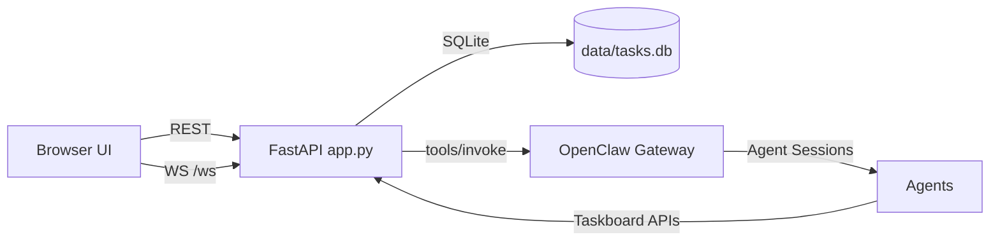
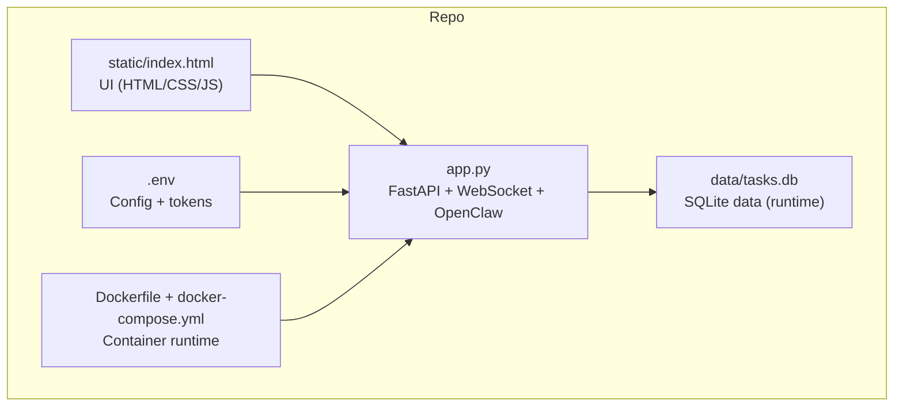
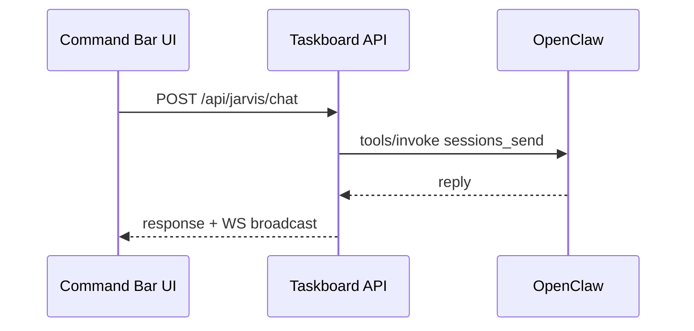
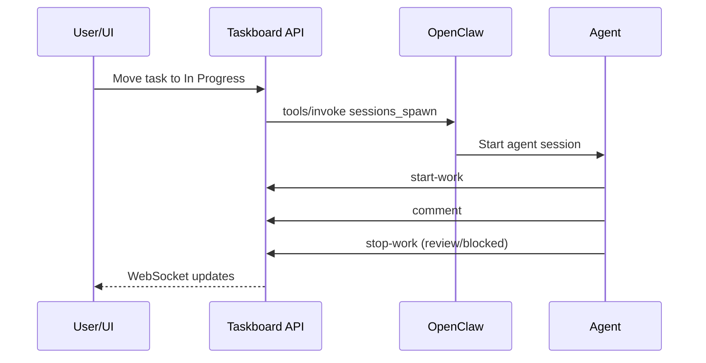
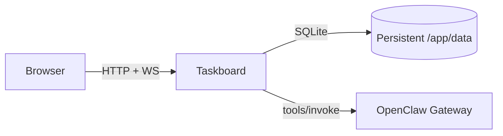
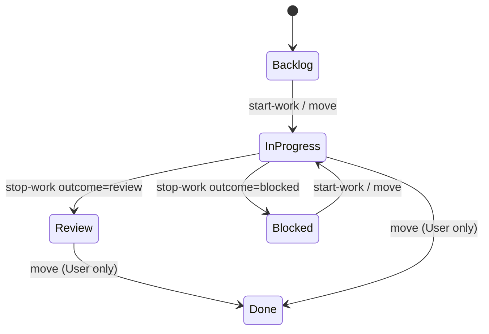

# OpenClaw Dev Taskboard — Engineer Understanding

## Purpose
This repository is a real-time Kanban task board built for coordinating human work with OpenClaw-powered AI agents. The FastAPI backend handles task storage, WebSocket updates, and OpenClaw session orchestration; the UI is a single-page app in `static/index.html`.

## Architecture Summary
- **Backend**: `app.py` (FastAPI, SQLite, WebSockets, OpenClaw integration).
- **Frontend**: `static/index.html` (HTML/CSS/JS bundled in one file).
- **Database**: `data/tasks.db` created at runtime for tasks, comments, action items, and chat history.
- **Containers**: `Dockerfile` + `docker-compose.yml` run the app on port 8080.



## Core Flows (Non-OpenClaw)
- UI loads config and tasks via `/api/config` and `/api/tasks`, then listens on `WS /ws` for updates.
- Task changes and comments are broadcast to all connected clients.
- Task lifecycle is controlled by `/api/tasks/{id}/move`, `/start-work`, and `/stop-work`.

## Components & Locations
- **API + WebSocket**: `app.py` (routes, models, database access, OpenClaw integration).
- **UI**: `static/index.html` (HTML structure, CSS variables, JS handlers, command bar).
- **Persistence**: `data/tasks.db` (SQLite tables for tasks, comments, action items, chat).
- **Configuration**: `.env` (OpenClaw tokens, API keys, branding, guardrails).
- **Docs/Templates**: `README.md`, `OPENCLAW_SETUP.md`, `examples/`.



## OpenClaw Integration (Complete Reference)

### What It Enables
- Auto-spawn agent sessions when tasks are active.
- @mention-driven expert reviews (Architect, Security, UX, etc.).
- Command-bar chat with the main agent session.
- Follow-up responses routed to the right agent session.

### Required Configuration
- `.env` variables:
  - `OPENCLAW_GATEWAY_URL` (e.g. `http://host.docker.internal:18789` when running in Docker)
  - `OPENCLAW_TOKEN` (enables integration when set)
  - `TASKBOARD_API_KEY` (required for agents to push responses)
- If `OPENCLAW_TOKEN` is empty, the board runs as a standard Kanban with no AI sessions.

### Agent Setup (OpenClaw Side)
Define these agents in OpenClaw (`config.yaml` or `OPENCLAW config`):
- `architect`
- `security-auditor`
- `code-reviewer`
- `ux-manager`
- `main` (the command-bar agent)

Sample mapping in `app.py`:
```
AGENT_TO_OPENCLAW_ID = {
  "Jarvis": "main",
  "Architect": "architect",
  "Security Auditor": "security-auditor",
  "Code Reviewer": "code-reviewer",
  "UX Manager": "ux-manager",
}
```
Update this map if your OpenClaw agent IDs differ.

### Guardrails Passed to Agents
Each spawned agent receives a guardrails block that includes:
- Allowed filesystem paths (`ALLOWED_PATHS` from `.env`).
- Forbidden actions (external tools, commits, etc.).
- Required workflow: start-work → comment → stop-work.
The template lives in `app.py` (`AGENT_GUARDRAILS`).

### Command Bar (Main Agent Chat)
- UI sends to `POST /api/jarvis/chat`.
- Backend calls OpenClaw `POST {OPENCLAW_GATEWAY_URL}/tools/invoke` with `tool: sessions_send`.
- Responses are persisted and returned to the UI.
- Agents can also push responses to `POST /api/jarvis/respond` (requires `TASKBOARD_API_KEY`).



### OpenClaw API Call Examples
**Spawn a session (task assignment)**
```bash
curl -X POST "$OPENCLAW_GATEWAY_URL/tools/invoke" \
  -H "Authorization: Bearer $OPENCLAW_TOKEN" \
  -H "Content-Type: application/json" \
  -d '{"tool":"sessions_spawn","args":{"agentId":"architect","task":"Task prompt...","label":"task-42","cleanup":"keep"}}'
```
Expected response (shape):
```json
{
  "ok": true,
  "result": {
    "childSessionKey": "agent:architect:abcd1234",
    "runId": "run_123"
  }
}
```

**Send a follow-up message to a session**
```bash
curl -X POST "$OPENCLAW_GATEWAY_URL/tools/invoke" \
  -H "Authorization: Bearer $OPENCLAW_TOKEN" \
  -H "Content-Type: application/json" \
  -d '{"tool":"sessions_send","args":{"sessionKey":"agent:architect:abcd1234","message":"User follow-up..."}}'
```
Expected response (shape):
```json
{
  "ok": true,
  "result": {
    "details": { "reply": "..." }
  }
}
```

**Wake OpenClaw for out-of-band comments**
```bash
curl -X POST "$OPENCLAW_GATEWAY_URL/api/cron/wake" \
  -H "Authorization: Bearer $OPENCLAW_TOKEN" \
  -H "Content-Type: application/json" \
  -d '{"action":"wake","text":"Task Board: New comment on #42..."}'
```
Expected response (shape):
```json
{ "ok": true }
```

### Session Management APIs (Backend → OpenClaw)
- `GET /api/sessions` → `sessions_list`
- `POST /api/sessions/create` → `sessions_spawn`
- `POST /api/sessions/{key}/stop` → `sessions_send` abort + `/api/sessions/{key}/abort`
- `POST /api/sessions/stop-all` → list + stop non-main sessions
- `DELETE /api/sessions/{key}` → stop, clear local history, remove from OpenClaw session store

### Task-to-Agent Workflow
1. Task enters **In Progress** (explicit move or via `/start-work`).
2. Backend spawns a session via OpenClaw `sessions_spawn` with the task prompt + guardrails.
3. Agent calls taskboard APIs directly:
   - `POST /api/tasks/{id}/start-work?agent=...`
   - `POST /api/tasks/{id}/comments`
   - `POST /api/tasks/{id}/stop-work?outcome=review|blocked&reason=...`
4. Backend broadcasts updates via WebSocket to all clients.



### Mentions and Follow-ups
- `@Agent` in a comment triggers `sessions_spawn` for the mentioned agent, plus a system comment.
- If a user replies on a task already in **In Progress** or **Review**, the backend attempts `sessions_send` to the saved session key; if that fails, it spawns a follow-up session with recent context.

### Wake Notifications
If a comment comes from an unknown agent name, the backend sends a wake signal to OpenClaw:
`POST {OPENCLAW_GATEWAY_URL}/api/cron/wake` with a summary of the comment.

### Command Bar Tooling (OpenClaw Side)
OpenClaw agents should include a TOOLS.md instruction for pushing responses:
```
Invoke-RestMethod -Uri "http://localhost:8080/api/jarvis/respond" \
  -Method POST -Headers @{"Content-Type"="application/json"; "X-API-Key"="YOUR_TASKBOARD_API_KEY"} \
  -Body '{"response":"Your message here"}'
```

### Docker/Host Networking Notes
- Use `host.docker.internal` for `OPENCLAW_GATEWAY_URL` when the task board runs in Docker.
- Ensure agents can reach `http://localhost:8080` (or your deployed URL) to post comments.

## Deployment

### Docker Compose (Recommended)
1. `cp .env.example .env` and set `OPENCLAW_GATEWAY_URL`, `OPENCLAW_TOKEN`, and `TASKBOARD_API_KEY`.
2. `docker-compose up -d`.
3. Visit `http://localhost:8080`.

### Local Python (Dev)
1. `pip install -r requirements.txt`.
2. `python -m uvicorn app:app --host 0.0.0.0 --port 8080`.

### Production Tips
- Set `TASKBOARD_API_KEY` before exposing the service.
- Restrict network access to trusted hosts or VPN.
- Persist `/app/data` as a volume to keep the SQLite DB.



## Task Status Lifecycle


## Troubleshooting
- **OpenClaw not responding**: confirm `OPENCLAW_TOKEN` and `OPENCLAW_GATEWAY_URL`, then retry `GET /api/sessions`.
- **Agents never spawn**: verify `AGENT_TO_OPENCLAW_ID` matches OpenClaw agent IDs and tasks are assigned to those agents.
- **Command bar replies missing**: ensure agents can call `POST /api/jarvis/respond` with `X-API-Key`.
- **No real-time updates**: check that `WS /ws` is reachable and not blocked by a proxy.
- **Docker can’t reach OpenClaw**: use `host.docker.internal` (Docker Desktop) or host IP on Linux.

## Deployment Checklist
- **Config**: `.env` populated (`OPENCLAW_GATEWAY_URL`, `OPENCLAW_TOKEN`, `TASKBOARD_API_KEY`).
- **Networking**: OpenClaw gateway reachable from the container/host.
- **Persistence**: `/app/data` mounted to keep `tasks.db` across restarts.
- **Security**: `TASKBOARD_API_KEY` set before exposing to non-localhost.
- **Health**: `GET /api/config` and `GET /api/tasks` return data.

## Running Locally
- `pip install -r requirements.txt`
- `python -m uvicorn app:app --host 0.0.0.0 --port 8080`
- Or `docker-compose up -d`

## Key Files to Know
- `app.py`: all API routes, OpenClaw integration, and guardrails.
- `static/index.html`: UI, command bar, and WebSocket handlers.
- `OPENCLAW_SETUP.md`: detailed integration steps.
- `examples/dev-team-example.md`: guardrail template for OpenClaw agents.
