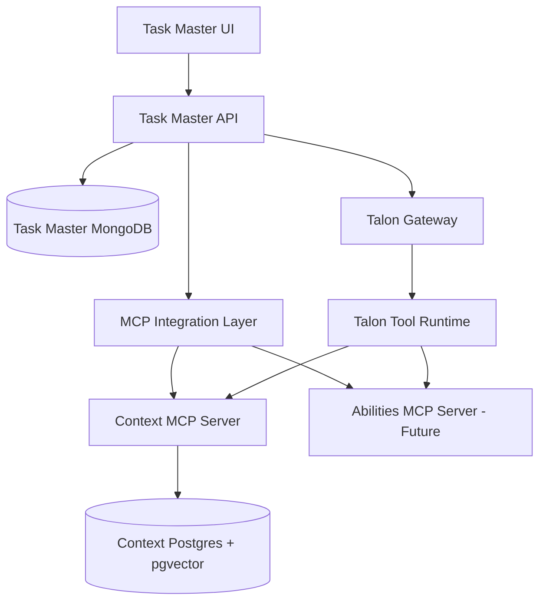
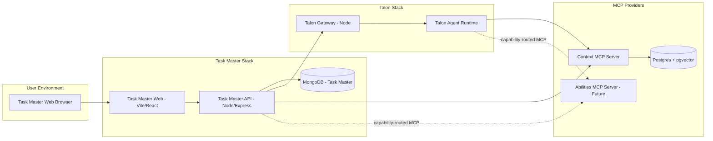
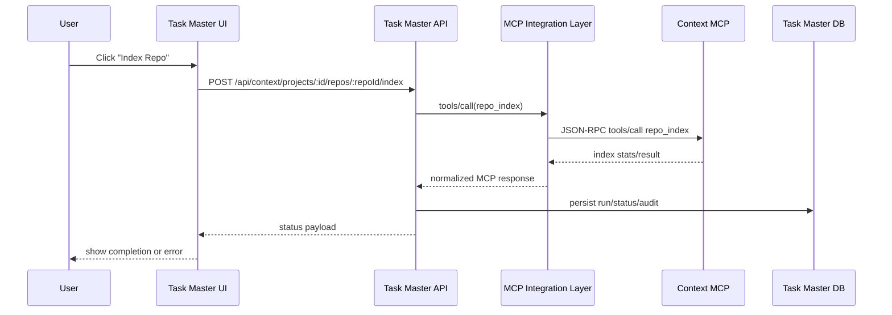
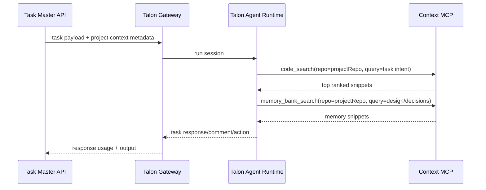

# Task Master Context Integration PRD

## Document Control
- Owner: Task Master + Talon platform team
- Status: Draft for implementation planning
- Last Updated: 2026-02-10
- Related Docs:
  - `docs/prds/context-mcp-integration-prd.md`
  - `apps/task-master/AGENTS.md`
  - `apps/talon/README.md`

## 1. Executive Summary
Task Master should let users configure repositories, trigger indexing, and monitor index health from the UI. Talon agents should then consume repository context through MCP tools to reason about tasks and code changes.

This design is MCP-first and MCP-extensible:
- No direct DB coupling between Task Master/Talon and Context internals.
- Task Master talks to MCP servers through a unified MCP integration layer.
- Talon consumes MCP tools through its existing tool/plugin runtime.
- Additional MCP servers (for example, `abilities`) can be added without redesigning the system.

## 2. Problem Statement
Current state has a capability gap:
- `savant-context` can index/search via CLI and MCP, but Task Master cannot manage indexing lifecycle from the product UI.
- Talon can execute tasks but has no project-scoped contract for selecting a context index per task/project.
- There is no multi-MCP registry/governance model in Task Master for future MCP providers.

Result: repository context is manual, brittle, and not operationally visible.

## 3. Goals
1. Enable project-level repo registration and indexing from Task Master UI.
2. Expose index status/health to product users and admins.
3. Let Talon agents query indexed context through MCP tools during task execution.
4. Support multiple MCP servers via a reusable integration architecture.
5. Maintain strong governance: auth, tool allowlisting, audit logs, and rate controls.

## 4. Non-Goals (V1)
1. Replacing Context’s embedding model/runtime.
2. Building cross-service distributed transactions.
3. Implementing real-time file watcher indexing.
4. Building generic workflow orchestration across all MCP tools in V1.

## 5. Personas
- Admin: configures MCP servers, allowed roots, project-to-repo mappings, and health policies.
- Product user: triggers reindex and views status for assigned project repos.
- Agent operator: ensures Talon tool policy and prompts reliably use context.
- Platform engineer: adds new MCP providers with minimal code changes.

## 6. Functional Requirements

### 6.1 Task Master Project Context Management
1. Add per-project context repository configuration.
2. Allow repo path + logical repo name + optional branch/ref metadata.
3. Trigger index/reindex from UI.
4. View per-repo status: indexed time, file count, chunk count, last error, duration.

### 6.2 MCP Lifecycle Operations
Task Master must support MCP operations for context providers:
1. list repositories
2. fetch repo status
3. index repo
4. delete repo index
5. validate health/connectivity

### 6.3 Talon Agent Context Usage
1. Talon receives project context metadata from Task Master.
2. Talon tools call MCP for `code_search`, `memory_bank_search`, and optional read/list tools.
3. Queries are repo-scoped by default unless agent explicitly requests cross-repo search.

### 6.4 Multi-MCP Extensibility
1. Register multiple MCP servers in Task Master (Context first, Abilities later).
2. Define server capability manifests and tool allowlists.
3. Route operations by capability, not by hardcoded provider.

## 7. Architecture

### 7.1 High-Level Architecture


### 7.1.1 Infrastructure Diagram


### 7.2 Interaction Sequence: Indexing from Task Master UI


### 7.3 Interaction Sequence: Talon Agent Execution with Context


## 8. Component Design

### 8.1 Task Master API: MCP Integration Layer
Add an internal module that abstracts MCP transport and capability routing.

Proposed internal interfaces:
- `McpServerRegistry`: configured servers, auth, capabilities, health state.
- `McpClient`: JSON-RPC transport (`initialize`, `tools/list`, `tools/call`).
- `McpCapabilityRouter`: maps operation (`repo_index`) -> provider tool name.
- `McpAuditLogger`: structured logs for each tool call.

Design constraints:
1. MCP transport must be provider-agnostic.
2. Tool call timeout/retry policy must be centralized.
3. Responses normalized into stable API payloads.

#### 8.1.1 Purpose
The MCP integration layer is the single control plane for all MCP communication in Task Master API.

It is responsible for:
1. provider connection management
2. capability-to-tool routing
3. policy enforcement (allowlists, path rules, auth checks)
4. reliability controls (timeouts/retries/concurrency guards)
5. normalized responses and audit traces

#### 8.1.2 Project Type and Deployment Model
V1 implementation is an internal module in `apps/task-master/apps/api` (not a standalone service).

Rationale:
1. reuses existing API stack and deployment topology
2. avoids additional network hop and service lifecycle complexity
3. can later be extracted to a dedicated service if scale or team ownership requires it

#### 8.1.3 Stack
1. Runtime: Node.js (existing Task Master API runtime)
2. Framework: Express routes + service layer
3. Validation: Zod contracts for inbound/outbound payloads
4. Persistence: Prisma + MongoDB for config/state/run history
5. MCP Transport:
- stdio JSON-RPC for local process servers like `savant-context run`
- optional HTTP transport extension point for future MCP servers
6. Optional async execution (later iteration): background worker/queue for long-running index operations

#### 8.1.4 Module Structure (Proposed)
```
apps/task-master/apps/api/src/mcp/
  types.js                 # normalized MCP and capability contracts
  registry.js              # MCP server config load/resolve
  client.js                # generic JSON-RPC client
  transport/
    stdio.js               # spawn + lifecycle management for stdio MCP
    http.js                # optional future transport
  router.js                # capability -> provider tool mapping
  policy.js                # allowlist/path/RBAC policy checks
  providers/
    context.js             # provider adapter + response normalization
    abilities.js           # future provider adapter
  service.js               # orchestration used by API routes
  audit.js                 # metrics + activity emission
  errors.js                # transport/tool error normalization
```

#### 8.1.5 Request Lifecycle
1. UI sends operation request (for example, index repo).
2. API route validates access and payload.
3. MCP service resolves target server and required capability.
4. Capability router maps operation to concrete tool name.
5. Policy layer validates tool allowlist and path restrictions.
6. MCP client executes `tools/call` with timeout/retry policy.
7. Provider adapter normalizes response shape.
8. Audit layer persists run status, activity, metrics, and correlation ID.
9. API returns stable result payload to UI.

#### 8.1.6 Extensibility Model
The layer is capability-based, not tool-name-based.

Example:
1. Task Master requests capability `repo.index`.
2. Context server maps to `repo_index`.
3. A future server (for example `abilities`) could map the same capability to `index_repository`.

This prevents API/UX code from changing when adding new MCP providers.

### 8.2 Task Master Data Model Extensions
Add minimal Mongo entities for orchestration and observability.

Proposed models:
1. `McpServerConfig`
- `name`, `type`, `transport`, `command`, `args`, `env`, `enabled`, `capabilities`, `toolAllowlist`

2. `ProjectContextRepo`
- `projectId`, `serverId`, `repoName`, `repoPath`, `enabled`, `defaultForProject`, `metadata`

3. `ProjectContextIndexRun`
- `projectId`, `repoId`, `triggeredBy`, `status`, `startedAt`, `endedAt`, `durationMs`, `filesIndexed`, `chunksIndexed`, `error`

### 8.3 Task Master API Endpoints (V1)
1. `GET /api/context/servers`
2. `POST /api/context/servers` (admin)
3. `PATCH /api/context/servers/:id` (admin)
4. `GET /api/projects/:projectId/context/repos`
5. `POST /api/projects/:projectId/context/repos`
6. `PATCH /api/projects/:projectId/context/repos/:repoId`
7. `POST /api/projects/:projectId/context/repos/:repoId/index`
8. `GET /api/projects/:projectId/context/repos/:repoId/status`
9. `DELETE /api/projects/:projectId/context/repos/:repoId`
10. `GET /api/projects/:projectId/context/index-runs`

### 8.4 Talon Integration
Approach:
1. Preserve Talon’s existing tool runtime.
2. Add Context tool adapter (plugin or core tool wrapper) that calls configured MCP server.
3. Enforce tool policy at channel/agent/profile levels.

Required behavior:
- Repo context defaults from Task Master metadata.
- Strict tool allowlist for context operations.
- Optional fallback behavior when Context unavailable.

## 9. MCP Capability Contract

### 9.1 Context V1 Required Tools
- `code_search`
- `memory_bank_search`
- `memory_resources_list`
- `memory_resources_read`
- `repos_list`
- `repo_status`
- `repo_index` (new)
- `repo_delete` (new)
- `repo_get` (new)

### 9.2 Capability Manifest (Generic for Future MCP Servers)
Each MCP server is registered with capabilities:
```json
{
  "serverType": "context",
  "capabilities": [
    "repo.index",
    "repo.status",
    "repo.delete",
    "search.code",
    "search.memory"
  ],
  "toolMap": {
    "repo.index": "repo_index",
    "repo.status": "repo_status",
    "repo.delete": "repo_delete",
    "search.code": "code_search",
    "search.memory": "memory_bank_search"
  }
}
```

This decouples Task Master/Talon from provider-specific tool names and enables adding servers like `abilities` with a different tool vocabulary.

## 10. Security and Governance
1. Path allowlist enforcement for index operations.
2. Strict MCP tool allowlist at server configuration and runtime.
3. Role-based access:
- admins manage server config
- project members trigger indexing only for accessible projects
4. Structured auditing for every MCP call:
- actor
- project/repo
- tool name
- latency
- status
- sanitized error
5. Secret management for server credentials via encrypted storage.

## 11. Reliability and Operations
1. Timeouts for all MCP calls (configurable, default 30s for read ops, 15m for index ops).
2. Idempotency key support for index trigger endpoint.
3. Concurrency guard: one active index run per repo.
4. Backoff retry for transient transport failures.
5. Health endpoint summarizing server availability and last successful call.

## 12. Observability
- Metrics:
  - `mcp_calls_total{server,tool,status}`
  - `mcp_call_latency_ms{server,tool}`
  - `context_index_runs_total{status}`
  - `context_index_duration_ms`
- Logs:
  - request/response metadata (sanitized)
  - correlation id propagated UI -> API -> Talon/MCP
- Activity feed events in Task Master:
  - `context.repo.registered`
  - `context.index.started`
  - `context.index.completed`
  - `context.index.failed`

## 13. UX Requirements
1. Project Settings includes a Context panel.
2. Repo cards show status, last run, and quick actions.
3. Index action provides immediate feedback + progress state.
4. Error states include actionable remediation text.
5. UI model supports multiple context providers later.

## 14. Gaps Analysis

### 14.1 Current Gaps in Context MCP
1. Missing lifecycle tools for index/delete/get.
2. No explicit async job contract for long index runs.
3. Limited multi-tenant controls.

### 14.2 Current Gaps in Task Master
1. No MCP server registry/configuration model.
2. No context repo domain model.
3. No endpoints/UI for context indexing lifecycle.
4. No MCP call audit/metrics pipeline.

### 14.3 Current Gaps in Talon
1. No dedicated context-provider abstraction for project repo scoping.
2. No default query plan for context retrieval in task execution.
3. Tool policy may not explicitly include future MCP capability groups.

## 15. Implementation Plan

### 15.1 Delivery Strategy
Implement in vertical slices so each phase is deployable and testable independently.

Each phase must include:
1. API contract updates
2. persistence updates
3. UI updates (when applicable)
4. observability hooks
5. docs and operator runbook updates

### 15.2 Workstream A: MCP Core Foundation (Task Master API)
Scope:
1. Build `src/mcp` module structure.
2. Implement stdio JSON-RPC client and server registry.
3. Implement capability router + tool allowlist policy.
4. Add common error model and audit hooks.

Deliverables:
1. `McpClient` with `initialize`, `tools/list`, `tools/call`.
2. `McpServerConfig` CRUD API (admin-only).
3. health probe endpoint for configured MCP servers.

Definition of done:
1. Context MCP can be registered and health-checked from API.
2. All MCP calls include correlation IDs and structured logs.

### 15.3 Workstream B: Project Context Repo Management (Task Master)
Scope:
1. Add `ProjectContextRepo` and `ProjectContextIndexRun` models.
2. Add repo registration/index/status/delete endpoints.
3. Add Project Settings UI panel for repo management.

Deliverables:
1. repo list/create/update/delete flows in UI + API.
2. index trigger action and status polling.
3. index run history table per project.

Definition of done:
1. user can register a repo and run indexing from UI.
2. index run states are persisted and visible.

### 15.4 Workstream C: Context MCP Contract Completion
Scope:
1. Ensure Context exposes lifecycle tools:
- `repo_index`
- `repo_get`
- `repo_delete`
2. Stabilize result schema for lifecycle and status operations.

Deliverables:
1. tool-level contract spec and compatibility tests.
2. error code conventions for retryable vs non-retryable failures.

Definition of done:
1. Task Master can fully operate repo lifecycle through MCP-only calls.

### 15.5 Workstream D: Talon Context Consumption
Scope:
1. Add Talon adapter/tool wrapper for context capabilities.
2. enforce repo-scoped query defaults using project metadata.
3. update prompt/run guidelines for query-then-summarize behavior.

Deliverables:
1. Talon tool integration with allowlist policies.
2. project context propagation contract Task Master -> Talon.
3. traceable tool usage in agent execution logs.

Definition of done:
1. Talon task runs use context tools and produce citations/snippets from configured repos.

### 15.6 Workstream E: Multi-MCP Extensibility
Scope:
1. Add support for second MCP provider (`abilities`) using same registry/router.
2. validate capability mapping model with heterogeneous tool names.

Deliverables:
1. provider adapter scaffold for `abilities`.
2. integration tests proving capability routing is provider-agnostic.

Definition of done:
1. second provider can be enabled without changing Project Settings UX contract.

### 15.7 Milestone Plan
1. Milestone M1: MCP Core + Server Registry (Workstream A)
2. Milestone M2: Project Repo UI/API + Index Runs (Workstream B)
3. Milestone M3: Context Contract Finalization (Workstream C)
4. Milestone M4: Talon Runtime Integration (Workstream D)
5. Milestone M5: Multi-MCP Validation with Abilities (Workstream E)

### 15.8 Implementation Checklist
1. Create Prisma schema updates for MCP config and context repo entities.
2. Add Zod schemas for all new MCP/context API payloads.
3. Implement `src/mcp` core modules and transport layer.
4. Implement admin endpoints for MCP server management.
5. Implement project context repo endpoints and index run endpoints.
6. Add Project Settings Context panel UI.
7. Implement Context provider adapter and lifecycle tool mappings.
8. Add Talon tool adapter for context search/repo status.
9. Add observability: metrics, activity events, audit logs.
10. Add integration tests (API + MCP mock), then production cutover checklist.

### 15.9 Dependency Order
1. Workstream C tool contracts must be stable before finalizing Workstream B/D integration behavior.
2. Workstream A must complete before B and D.
3. Workstream E starts only after M1-M4 are production-stable.

## 16. Acceptance Criteria
1. A user can add a project repo and trigger indexing from Task Master UI.
2. Status and index history are visible and accurate.
3. Talon task runs can retrieve context snippets for the configured repo.
4. All cross-service operations use MCP only.
5. A second MCP server can be configured through the same server registry + capability mapping mechanism.

## 17. Risks and Mitigations
1. Risk: long-running index jobs block API workers.
- Mitigation: async job queue in a later implementation increment if needed.

2. Risk: repo path misuse or unauthorized filesystem access.
- Mitigation: strict allowed roots + admin-only path configuration.

3. Risk: MCP schema drift across providers.
- Mitigation: capability manifest + contract tests.

4. Risk: weak agent behavior when context missing.
- Mitigation: explicit fallback prompt policy and deterministic tool retry strategy.

## 18. Open Questions
1. Should index operations be synchronous in V1 or queued from day one?
2. Should one project support multiple repos with ranking/priority at prompt time?
3. Do we need per-user access controls for specific repos beyond project access?
4. Should Talon call MCP directly only, or optionally via Task Master proxy for governance?
5. How should we standardize tool result envelopes for non-Context MCP providers?

## 19. Future-Proofing Design Principles
1. Capability-based routing over hardcoded tool names.
2. Provider isolation: each MCP server can fail independently.
3. Additive schema evolution: new capabilities should not break existing flows.
4. Policy-first controls: allowlist/denylist at server, project, and agent levels.
5. Portable integration: no assumptions about underlying DB or language runtime in provider.
